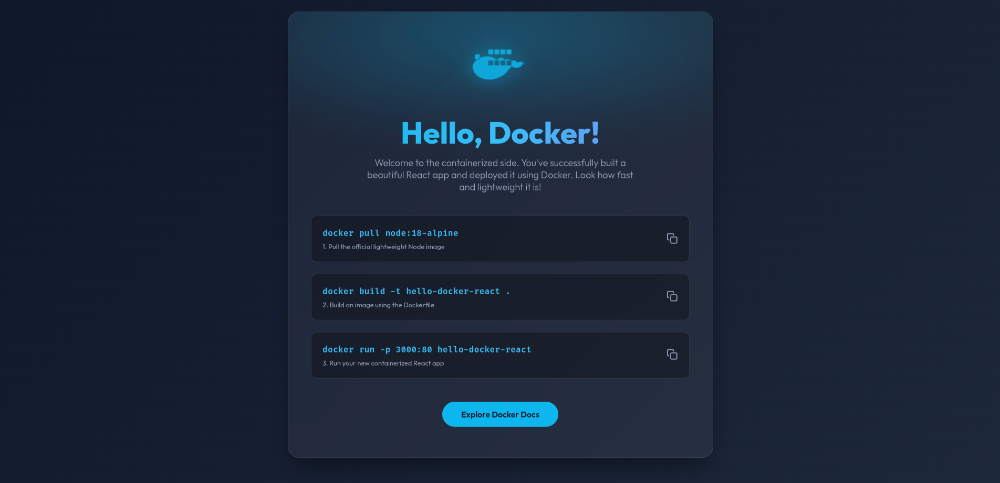

# ReactJS Docker Practice

A beginner-friendly landing page project built with React (Vite) to practice containerization and modern web development workflows.

## 📸 Overview



## 🚀 How to Run the Project

This project can be run locally using Node.js or via Docker containers.

### 1. Running Locally (Node.js)

1. **Install dependencies**
   Make sure you have [Node.js](https://nodejs.org/) installed, then run:
   ```bash
   npm install
   ```

2. **Start the development server**
   ```bash
   npm run dev
   ```

3. Open your browser and navigate to the local URL provided by Vite (usually `http://localhost:5173`).

## 🛠 Tech Stack

- **Framework**: React 19
- **Build Tool**: Vite


# Docker build and run instructions

## Build

0. How to build the app manually (without docker)
```bash
// install node
npm install
npm run build
npm i -g serve
serve -s dist -l 3000
```

Development: npm run dev => hot reload - using nodejs for running

Production: npm run build => build for production - using nodejs for building => using staic files => JS engine in browser will run static files => no need for nodejs for running

1. Choose a base image (smallest size, alpine/slim)
```
FROM node:20-alpine
```
2. Move manual steps into Dockerfile
- .dockerignore: Exclude files not needed in the image (node_modules, dist, .git, etc.)
- COPY package.json .
- RUN npm install --verbose
- COPY . .
- RUN npm run build
- RUN npm i -g serve
- ENTRYPOINT ["serve", "-s", "dist", "-l", "3000"]

2.1 Optimize
- Using serve => runnong by node => still need nodejs for running => not good for production => use nginx instead
- node_modules is too big => use npm ci instead of npm install
- Use multi-build stages => separate mono-build into builder and runner stages

3. Build image
```
docker build . -t docker-example
docker image ls
```

4. Run inage to container
```
docker run -d -p 8000:80 --name docker-example docker-example:latest
```

5. Check container
```
docker ps
```

6. Access into a container
```
docker exec -it docker-example sh | bash
```

7. Remove a container
```
docker stop <name|id>
docker rm <name|id>
```
```
docker rm -f <name|id>
```